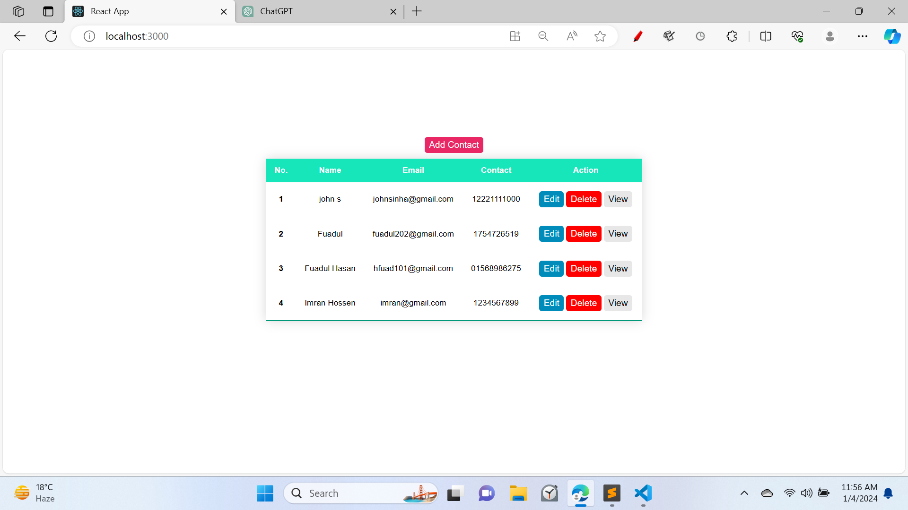
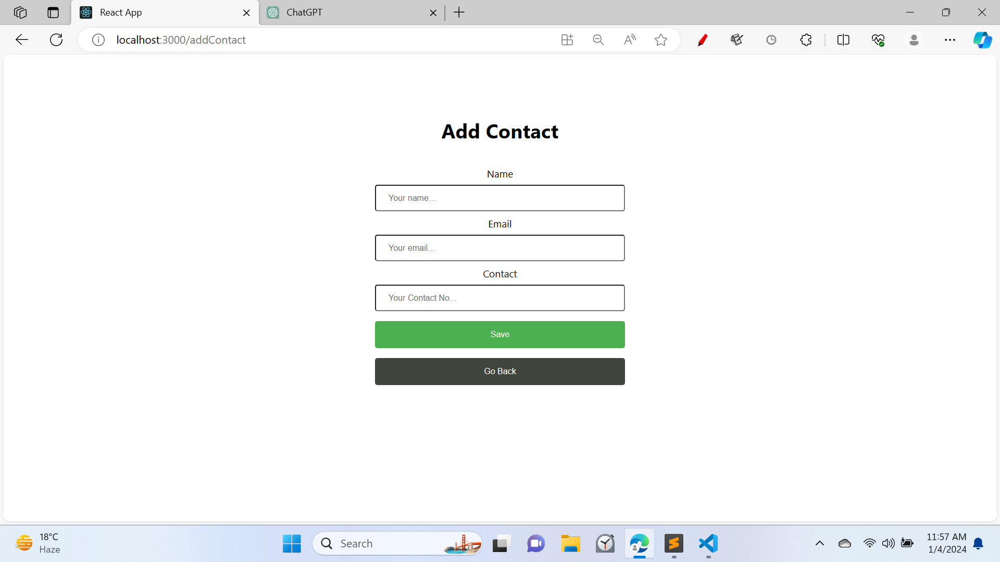
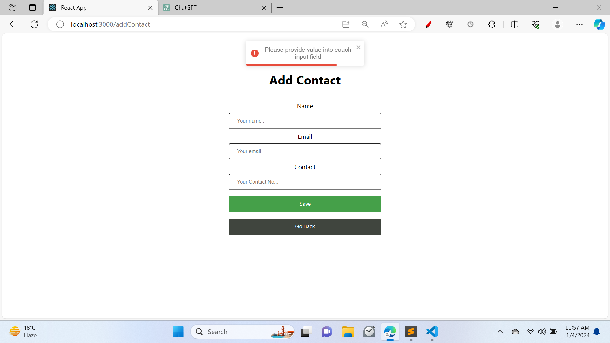
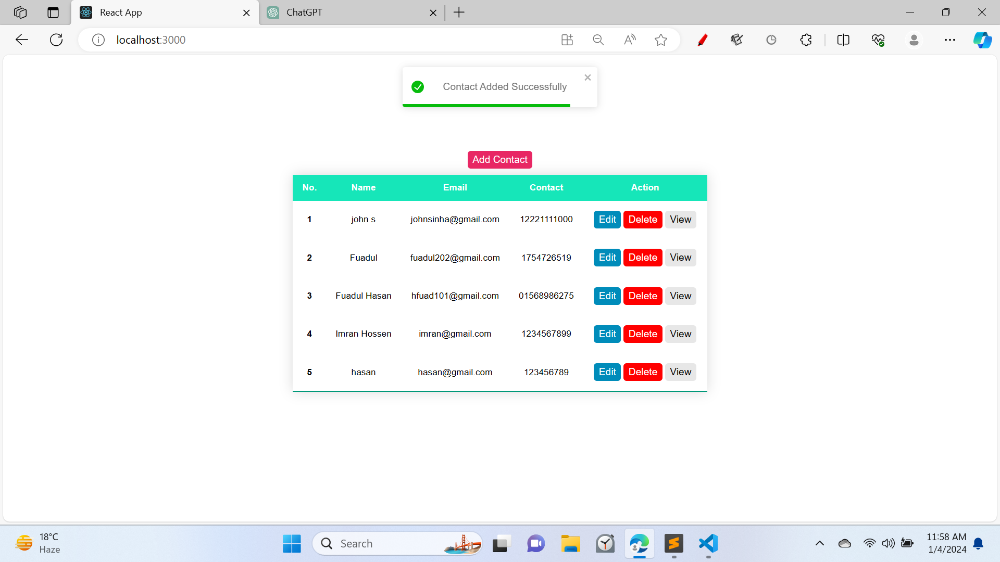
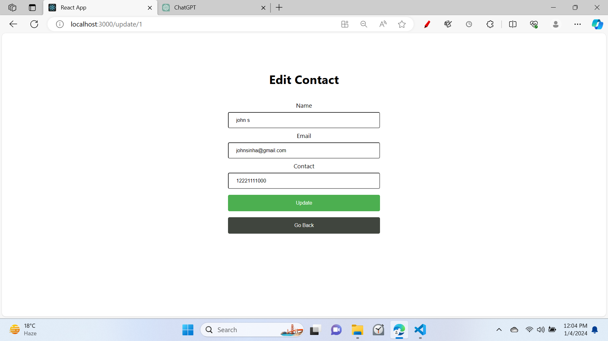
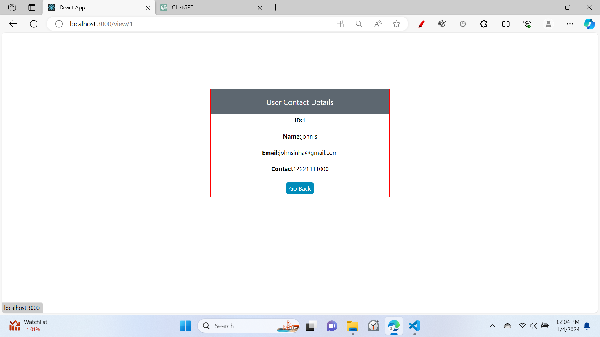
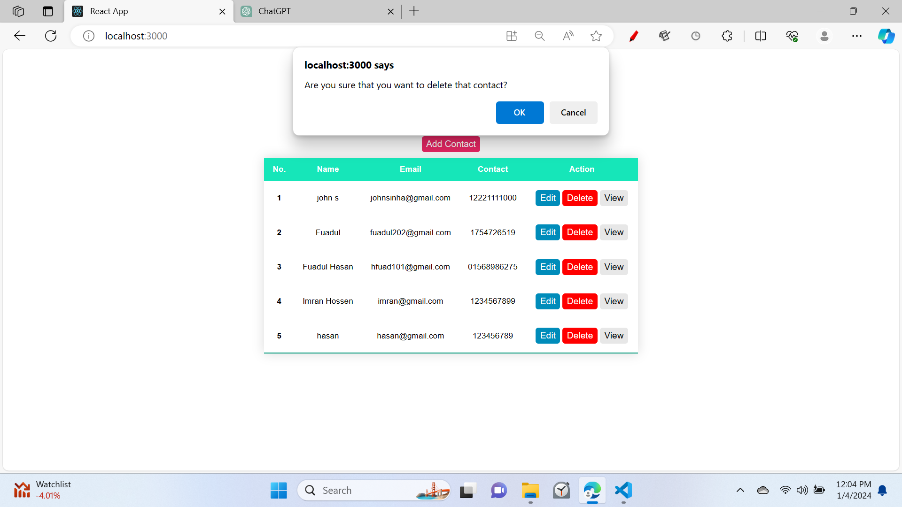
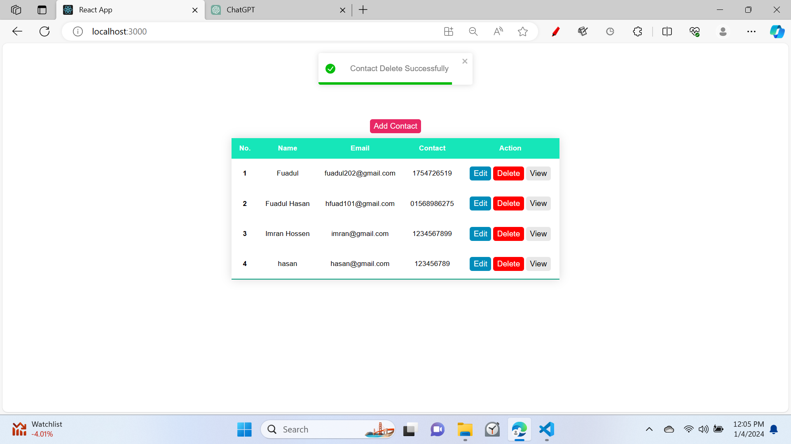

<h1 align="center">Full Stack CRUD Project</h1>

It's a CRUD project built in **React**, **Express**, **MySql**, **Node.js**.

In the **back-end** Data is fatching from the **MySql** using **API** calls.

In the **front-end** I use **React** to show the data.

<H2 align="center">Home Page</h2>

<H2 align="center">Add a new Contact Page</h2>

<H2 align="center">A warning will appear if all fields are not filled</h2>

<H2 align="center">After adding new Contact</h2>

<H2 align="center">User can update information</h2>

<H2 align="center">View Page</h2>

<H2 align="center">Showing Worning when delete Contact</h2>

<H2 align="center">Toast message of delete successfully</h2>

create a server folder then go to this folder to run
>> npm init
>> npm i body-parser cors express mysql2 nodemon
>> npm run server

after making all the connections and getting data from the database let's create our React app
go to this folder to run
>> npx create-react-app client
>> npm i react-router-dom axios react-toastify
>> npm start
	