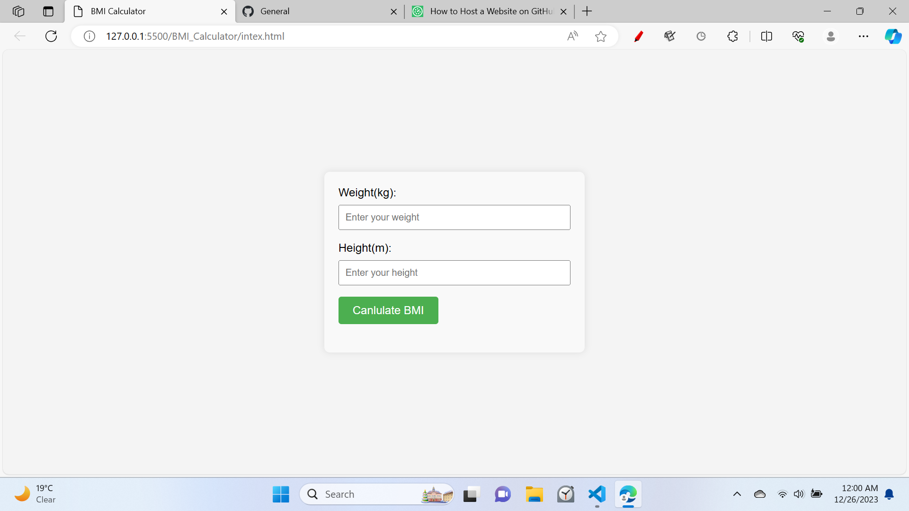
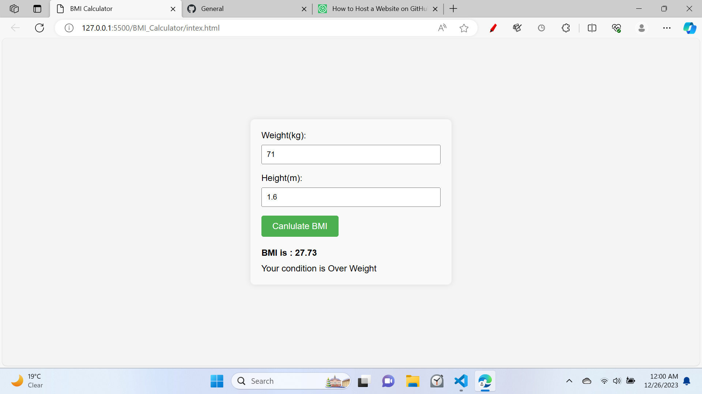
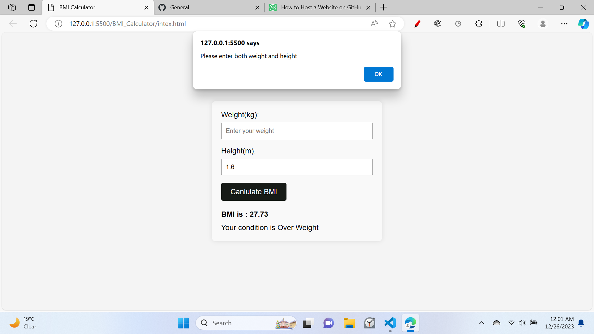

<h1 align="center">BMI Canculator Project</h1>
you have to give your height and weight and you will get your BMI value and your present condition of health.

## Initial stage

## Given Input and see results stage

## Give alart if input is not proper
